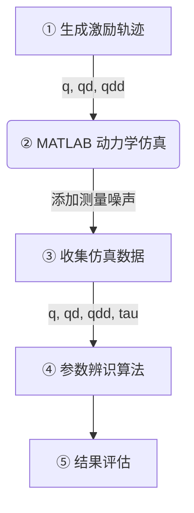
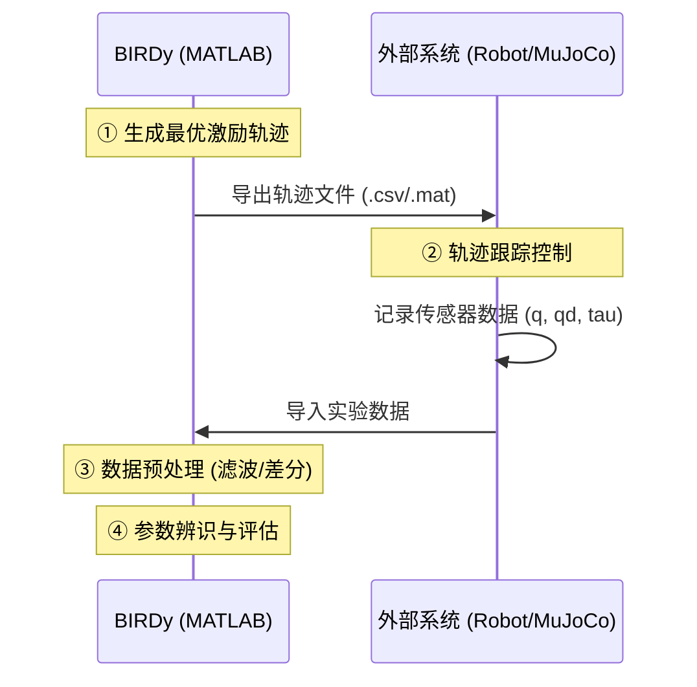

# BIRDy 工作模式详解

本此文档详细描述了 BIRDy (Benchmark for Identification of Robot Dynamics) 框架的两种主要工作模式。BIRDy 是一个用于机器人动力学参数辨识的 MATLAB 基准框架，本项目参考了该框架并将其与 ROS 2 和 MuJoCo 仿真环境进行了集成。

## 1. 仿真模式 (Simulation Mode)

仿真模式完全在 MATLAB 环境中运行，不需要外部的机器人硬件或仿真器。这种模式主要用于算法的验证、比较和基准测试，因为它提供了一个可控的、可重复的测试环境。

### 1.1 工作流程

整个流程闭环在 MATLAB 内部完成：

### 1.2 详细步骤

1.  **生成激励轨迹 (Excitation Trajectory Generation)**
    *   **生成原理 (Generation Principle)**: 
        激励轨迹不是随机生成的，而是通过**有限项 Fourier 级数 (Finite Fourier Series)** 进行参数化描述的。这就保证了轨迹是平滑、周期性且无限可微的（可以直接解析求导得到速度和加速度）。
        对于每个关节 $i$，其位置轨迹 $q_i(t)$ 定义为：
        $$ q_i(t) = q_{i,0} + \sum_{k=1}^{N} \left( \frac{a_{i,k}}{\omega_f k} \sin(\omega_f k t) - \frac{b_{i,k}}{\omega_f k} \cos(\omega_f k t) \right) $$
        其中：
        *   $\omega_f = \frac{2\pi}{T}$ 是基频 (Fundamental Frequency)，$T$ 是轨迹周期（通常为 10秒或 20秒）。
        *   $N$ 是谐波项数 (Number of Harmonics)，通常取 5。
        *   $a_{i,k}, b_{i,k}$ 是待优化的 Fourier 系数。
        *   $q_{i,0}$ 是关节的初始偏置。

    *   **优化过程 (Optimization)**:
        轨迹生成的本质是一个**非线性优化问题**。
        *   **优化变量**: 所有关节的 Fourier 系数集合 $\{a, b, q_0\}$。
        *   **目标函数**: 最小化观测矩阵 $W$ 的条件数 $\text{cond}(W) = \frac{\sigma_{max}(W)}{\sigma_{min}(W)}$。条件数越小（接近1），参数辨识对于测量噪声越不敏感，结果越鲁棒。
        *   **约束条件**: 必须满足机器人的物理限制（关节位置极限、速度极限、加速度极限），以及边界条件（如起始时刻速度、加速度为0）。

    *   **频率说明 (Frequency)**:
        *   **生成频率**: 从数学角度看，Fourier 轨迹是**连续时间 (Continuous-time)** 的函数，并没有固定的"生成频率"。
        *   **采样频率**: 在执行仿真时，轨迹会被离散化采样。
            *   在 **MATLAB 仿真模式** 下，通常使用 **1000 Hz** (1ms) 的采样率进行高精度动力学积分。
            *   在 **ROS 2 / MuJoCo 仿真模式** (本项目配置) 下，默认采样/控制频率为 **100 Hz** (10ms)，但这可以通过 `config/panda_sim_node.yaml` 中的 `publish_rate_hz` 参数进行修改。
            *   **注意**: 即使是 100Hz 的控制频率，由于轨迹是解析连续的，我们可以随时计算任意时刻 $t$ 的精确 $(q, \dot{q}, \ddot{q})$ 值，而不需要通过差分。

2.  **MATLAB 仿真执行 (Dynamics Simulation)**
    *   利用机器人真实的动力学参数 $\beta_{true}$ 进行逆动力学计算，得到理想力矩 $\tau_{ideal}$：
        $$ \tau_{ideal} = M(q)\ddot{q} + C(q, \dot{q})\dot{q} + G(q) $$
    *   **计算量详解**: 在仿真过程中，BIRDy 实际上计算并存储了非常详尽的数据，涵盖了理想值、期望值和测量值三类：
        
        **1. 关节空间运动学量 (Joint Space Kinematics)**
        *   **期望值 (Desired)**: $q_d, \dot{q}_d, \ddot{q}_d$ (来自轨迹生成器)。
        *   **真实/理想值 (Real/Ideal)**: $q, \dot{q}, \ddot{q}$ (动力学积分的无噪声结果)。
        *   **测量值 (Measured)**: $q_m, \dot{q}_m, \ddot{q}_m$ (在$q$基础上添加编码器噪声 `sd_q`，速度和加速度通常通过有限差分获得)。

        **2. 笛卡尔空间运动学量 (Cartesian Space Kinematics)**
        *   利用正运动学 ($T(q)$) 和雅可比矩阵 ($J(q)$) 计算末端执行器的状态。
        *   **位置**: $X, X_d, X_m$ (真实、期望、测量)。
        *   **速度**: $\dot{X}, \dot{X}_d, \dot{X}_m$。

        **3. 动力学量 (Dynamics)**
        *   **控制力矩 (Control Torque)**: $\tau$ (控制器基于测量状态 $q_m, \dot{q}_m$ 计算出的指令力矩)。
        *   **测量力矩 (Measured Torque)**: $\tau_m$ (在 $\tau$ 基础上添加力矩传感器噪声 `sd_tau`)。
        *   **摩擦力矩 (Friction Torque)**: $\tau_f$ (基于选定的摩擦模型，如 Coulomb, Viscous, Stribeck, LuGre 等计算)。

    *   这种详尽的数据记录使得用户可以深入分析控制器的跟踪性能、观测器的估计效果以及辨识算法的抗噪能力。

    *   **仿真步进机制详情 (Simulation Step Mechanism)**:
        在 MATLAB 仿真器的每一个时间步（Time Step, $t_k \to t_{k+1}$），系统按照以下流程进行状态更新和数据记录：

        1.  **接受输入 (Inputs)**:
            *   **当前时刻**: $t_k$
            *   **期望状态**: 从轨迹生成器中获取当前时刻的期望位置 $q_d(t_k)$ 和期望速度 $\dot{q}_d(t_k)$。
            *   **上一时刻的测量状态**: $\hat{x}_k = [q_m(t_k); \dot{q}_m(t_k)]$ (包含噪声，用于闭环控制)。
            *   **真实状态**: $x_k = [q(t_k); \dot{q}(t_k)]$ (无噪声，用于物理演化)。

        2.  **状态更新 (State Update)**:
            *   **a. 计算控制律 (Control Law)**:
                基于测量状态和期望状态计算 PID 控制力矩：
                $$ \tau_{cmd} = K_p(q_d - q_m) + K_d(\dot{q}_d - \dot{q}_m) + K_i \int (q_d - q_m) dt $$
                *(注：此处仅使用 PID 反馈，部分实现可能包含前馈补偿)*
            *   **b. 正动力学演化 (Forward Dynamics)**:
                将控制力矩作用于机器人物理模型，计算真实角加速度：
                $$ \ddot{q}_{real} = M(q)^{-1} (\tau_{cmd} - C(q,\dot{q})\dot{q} - G(q) - \tau_{friction}) $$
            *   **c. 数值积分解算 (Integration)**:
                使用数值积分器（如 RK1/Euler, RK4, ODE45）推演下一时刻的真实状态：
                $$ \begin{cases} \dot{q}_{k+1} = \dot{q}_k + \int_{t_k}^{t_{k+1}} \ddot{q}_{real} dt \\ q_{k+1} = q_k + \int_{t_k}^{t_{k+1}} \dot{q} dt \end{cases} $$

        3.  **输出更新 (Outputs)**:
            *   **模拟传感器**: 对新的真实状态 $x_{k+1}$ 添加高斯白噪声，生成新的测量值 $q_m(t_{k+1})$。
            *   **数据存储**: 如果 $t_k$ 对应采样点，则将 $q, q_m, q_d, \tau, X$ 等所有量存入数据结构。

3.  **收集仿真数据 (Data Collection)**
    *   在理想数据的基础上添加高斯白噪声，模拟真实传感器的测量误差。
    *   **注意**：在仿真模式下，由于轨迹是解析生成的，我们可以直接获得"完美"的或仅含噪声的加速度信号 $\ddot{q}$，这在真实实验中通常是不可行的（需要差分）。

4.  **参数辨识 (Parameter Identification)**
    *   使用生成的观测矩阵 $W$ 和力矩数据 $\tau$，构建线性方程组 $W\beta = \tau$。
    *   应用辨识算法求解参数 $\beta$。支持的算法包括：
        *   最小二乘法 (OLS, WLS)
        *   闭环输入误差法 (CLIE)
        *   卡尔曼滤波类 (EKF, UKF)
        *   粒子滤波 (PF)

5.  **结果评估 (Evaluation)**
    *   计算辨识出的参数 $\beta_{est}$ 与真实参数 $\beta_{true}$ 的误差。
    *   验证力矩预测精度（Cross-Validation）。

---

## 2. 实验模式 (Experiment Mode)

实验模式用于真实的物理机器人或外部的高保真仿真器（如本项目的 MuJoCo 环境）。在这种模式下，BIRDy 主要充当轨迹生成器和数据分析器的角色，而轨迹的执行和数据采集由外部系统完成。

### 2.1 工作流程

流程跨越了 MATLAB 和外部系统（Real Robot / ROS 2）：

### 2.2 详细步骤

1.  **生成激励轨迹**
    *   与仿真模式相同，在 MATLAB 中生成最优激励轨迹。
    *   **导出**：将生成的轨迹离散化并导出为外部系统可读取的格式（如 CSV 或 MAT 文件）。包含时间戳 $t$、期望位置 $q_d$、期望速度 $\dot{q}_d$ 和前馈力矩 $\tau_{ff}$。

2.  **外部执行轨迹 (Execution)**
    *   **控制器**：外部系统（如本项目的 ROS 2 节点）读取轨迹文件。
    *   **跟踪**：使用关节位置控制器（如 PD 控制）跟踪期望轨迹。
    *   **采集**：以高频率（如 1kHz）记录实际的关节位置 $q$、关节速度 $\dot{q}$ 和关节力矩 $\tau$。
    *   *注意*：通常无法直接测量关节加速度 $\ddot{q}$。

3.  **导入实验数据**
    *   将外部系统记录的数据文件加载回 MATLAB 环境。

4.  **数据预处理 (Data Preprocessing)**
    *   这是实验模式的关键步骤。
    *   **滤波**：使用零相移滤波器（如 `filtfilt`）去除测量数据中的高频噪声。
    *   **数值微分**：对滤波后的速度 $\dot{q}$ 进行数值微分，计算得到关节加速度 $\ddot{q}$。

5.  **参数辨识与评估**
    *   使用处理后的实验数据 $(q, \dot{q}, \ddot{q}, \tau)$ 构建观测矩阵。
    *   执行辨识算法估计参数。
    *   **验证**：由于真实机器人的物理真值通常未知，评估主要依赖于**验证集测试**（使用另一条轨迹，比较预测力矩与实际测量力矩的吻合程度）。

## 3. 两种模式的对比

| 特性                    | 仿真模式                 | 实验模式                             |
| :---------------------- | :----------------------- | :----------------------------------- |
| **主要用途**            | 算法研究、验证代码正确性 | 实际机器人建模、控制器设计           |
| **数据来源**            | 数学模型生成             | 传感器采集                           |
| **加速度获取**          | 解析计算 (精确)          | 数值微分 (含噪声)                    |
| **真值 (Ground Truth)** | 已知 ($\beta_{true}$)    | 通常未知                             |
| **噪声特性**            | 人工添加的高斯白噪声     | 包含摩擦、柔性、传感器噪声等复杂特性 |
| **复杂度**              | 低                       | 高 (涉及通信、控制、信号处理)        |
